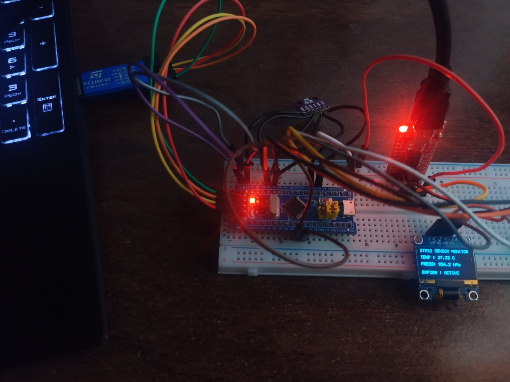
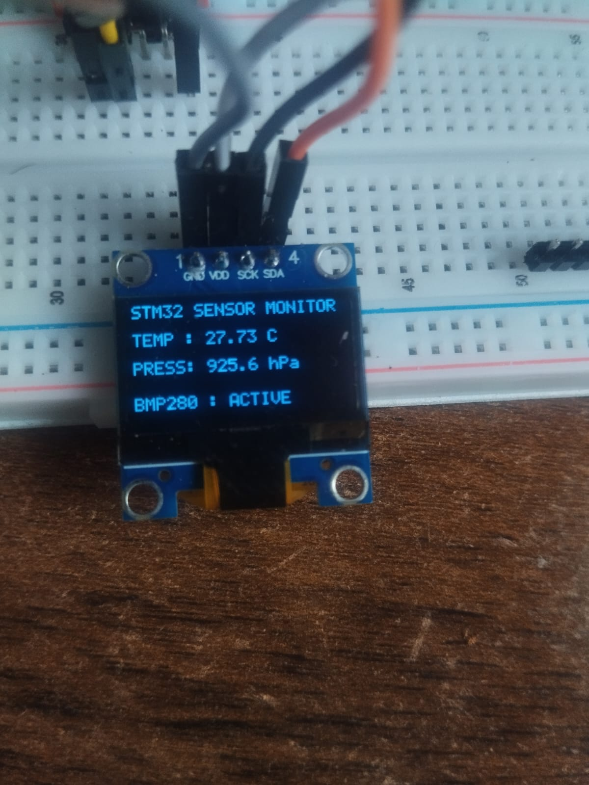
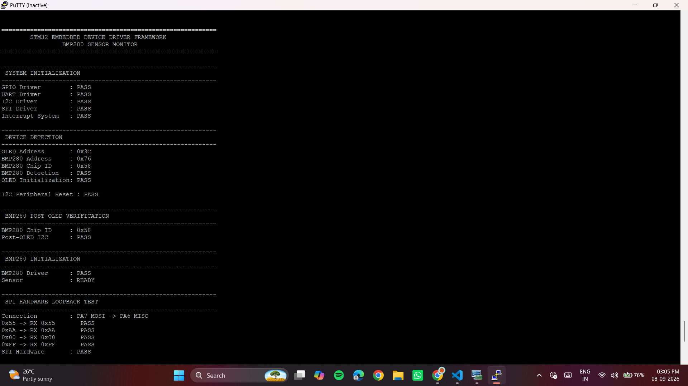
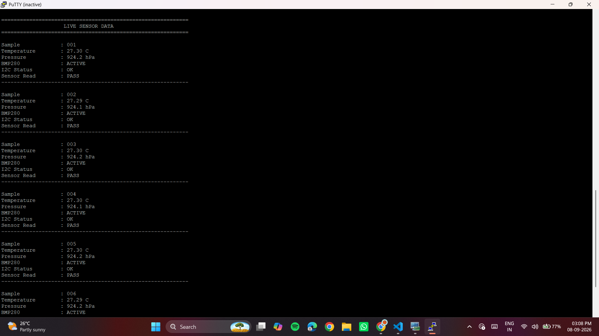

# STM32 Embedded Driver Framework

A bare-metal, register-level device driver framework built from scratch in C for the **STM32F103C8T6 (Blue Pill)**. The project implements a layered architecture (application → driver → hardware register) with no HAL libraries and no RTOS, integrating a BMP280 sensor and SSD1306 OLED display over I2C, with UART and SPI peripherals validated on real hardware.


*Complete setup: STM32F103C8T6, BMP280 sensor, SSD1306 OLED, and ST-Link V2 programmer.*

## Overview

The goal of this project was to understand how embedded device drivers work internally — configuring peripherals directly through memory-mapped registers instead of relying on vendor HAL libraries. The framework separates application logic from hardware-specific implementation through a clean driver layer.

```
                APPLICATION
                    │
                    ▼
              DRIVER LAYER
       ┌────────┬───────┬───────┬───────┐
       │ GPIO   │ UART  │ SPI   │  I2C   │
       └────────┴───────┴───────┴───────┘
                    │
                    ▼
              HARDWARE REGISTERS
                    │
                    ▼
             STM32F103C8T6
                    │
       ┌────────────┼─────────────┐
       ▼             ▼             ▼
     OLED         BMP280       SPI Loopback
```

## Features

- **GPIO Driver** — register-level pin configuration (CRL/CRH) and control, validated with an onboard LED.
- **UART Driver (USART1)** — TX via polling (TXE flag), RX via interrupt (RXNE + `USART1_IRQHandler`). 115200 baud, 8N1.
- **SPI Driver (SPI1, Master mode)** — validated via hardware loopback (MOSI ↔ MISO).
- **I2C Driver (I2C1)** — manual START/STOP condition generation, address/ACK handling, register read/write — shared across two real devices on the bus.
- **BMP280 Sensor** — I2C-based temperature and pressure readings, continuously sampled and converted to human-readable values.
- **SSD1306 OLED Display** — I2C-based, displays live sensor readings.
- **Custom Startup Code & Vector Table** — hand-written `Reset_Handler` (copies `.data`, clears `.bss`, calls `main`) and interrupt vector table including the USART1 handler.
- **Custom Linker Script** — defines STM32F103's Flash (`0x08000000`) and RAM (`0x20000000`) memory regions and places `.text`, `.rodata`, `.data`, and `.bss` sections accordingly.

## Hardware Connections

| Peripheral | Pins | Notes |
|---|---|---|
| UART (USART1) | PA9 (TX), PA10 (RX) | 115200 baud, connected via CP2102 USB-UART |
| SPI (SPI1) | PA5 (SCK), PA6 (MISO), PA7 (MOSI) | MOSI–MISO hardware loopback for validation |
| I2C (I2C1) | PB6 (SCL), PB7 (SDA) | Shared bus — OLED (`0x3C`) and BMP280 (`0x76`) |
| GPIO | Onboard LED pin | Digital output validation |

## Development & Validation Workflow

```
Write Driver → Compile → Renode Simulation → Generate ELF/BIN → Flash via ST-Link → Real Hardware Validation
```

1. **Renode simulation** — the STM32F103 platform is emulated to load the ELF, execute startup code, and debug firmware logic before touching real hardware.
2. **Real hardware validation** — firmware is flashed onto the physical Blue Pill via ST-Link V2 and tested end-to-end.

### Validation Results

- **SPI loopback:** `0x55 → 0x55`, `0xAA → 0xAA`, `0x00 → 0x00`, `0xFF → 0xFF` — confirms correct TXE/RXNE/BSY flag handling and data integrity.
- **I2C bus scan:** OLED detected at `0x3C`, BMP280 detected at `0x76`.
- **BMP280 output:** Chip ID `0x58` confirmed; live readings — e.g. Temperature: `27.30°C`, Pressure: `924.2 hPa` — displayed on both UART terminal and OLED.
- **UART:** interrupt-driven reception confirmed via `USART1_IRQHandler`.


*OLED displaying live temperature and pressure readings from the BMP280.*


*UART terminal (PuTTY) showing driver initialization, device detection, and SPI hardware loopback test results — all PASS.*


*Continuous BMP280 sensor readings streamed over UART, sample by sample.*

## Toolchain

- **Compiler:** ARM GNU Toolchain (`arm-none-eabi-gcc`)
- **Simulation:** Renode
- **Flashing:** ST-Link V2 (`st-flash` / STM32CubeProgrammer)
- **Language:** C (bare-metal, register-level — no HAL, no RTOS)

## Known Limitations & Planned Improvements

- **UART RX currently uses a single-byte buffer**, not a circular/ring buffer — under bursty reception, new bytes can overwrite unread data. A ring buffer (head/tail indices, `volatile` storage, full-buffer check) is planned to decouple ISR-driven reception from application-side processing without data loss.
- **No explicit I2C error handling yet** (e.g., NACK retry, bus timeout) — currently assumes the happy path; adding timeout-based recovery is a next step.
- Possible future addition: altitude calculation from BMP280 pressure data.

## Repository Structure

```
├── src/
│   ├── gpio.c / gpio.h
│   ├── uart.c / uart.h
│   ├── spi.c / spi.h
│   ├── i2c.c / i2c.h
│   ├── bmp280.c / bmp280.h
│   ├── ssd1306.c / ssd1306.h
│   ├── startup.c
│   └── main.c
├── linker/
│   └── stm32f103.ld
├── assets/
│   ├── demo.jpg
│   ├── oled-output.jpg
│   ├── uart-terminal-init.png
│   └── uart-terminal-live.png
└── README.md
```


**Rohit Patil**

Device drivers | embedded systems
